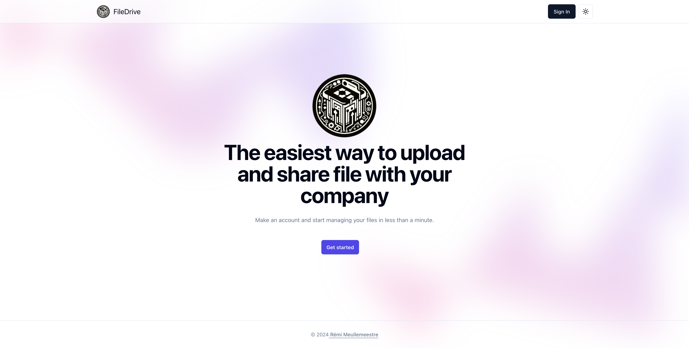

# Portfolio

<!-- [https://remimeullemeestre.dev](https://remimeullemeestre.dev) -->

## Description

This is a fullstack file storage application with organizations, file upload, management, role based authorization, authentication, cron deletes, favorites, trash feature, including many UI components like dialogs, modals, toasts, dropdown, etc.



## Stack

- [Next.js](https://nextjs.org) - Next.js by Vercel is the full-stack React framework for the web. Production grade React applications that scale. The world's leading companies use Next.js by Vercel to build static and dynamic websites and web applications.
- [React.js](https://react.dev) - The library for web and native user interfaces. Build user interfaces out of individual pieces called components written in JavaScript. React is designed to let you seamlessly combine components written by independent people, teams, and organizations.
- [TypeScript](https://www.typescriptlang.org) - TypeScript is a strongly typed programming language that builds on JavaScript, giving you better tooling at any scale. Learn how to use TypeScript with editor checks, auto-complete, interfaces, JSX, const, and more.
- [Convex](https://www.convex.dev) - Convex is the backend-as-a-service for builders. Thoughtfully curated components, optimized by experts. Get started. Not just a database. Everything your product deserves to build, launch, and scale. Learn more. A fresh take on writing your backend. Queries. Mutations. Actions.
- [Clerk](https://www.clerk.com) - Clerk is a suite of components and APIs to authenticate and manage your users with flexible and secure options. Learn how to use Clerk for multifactor authentication, session management, device browser location, social sign-on, bot detection, email and SMS one-time passcodes, and more.
- [Tailwind](https://tailwindcss.com) - Tailwind CSS is a framework that lets you build any design, directly in your HTML, with classes like flex, pt-4, text-center and rotate-90. It is easy to customize, scalable, and has a large community of adopters and creators who love its speed, flexibility and design-first approach.
- [Shadcn/ui](https://ui.shadcn.com) - shadcn/ui is a website that offers beautiful and customizable UI components that you can copy and paste into your apps. You can also access your GitHub repositories and issues from the website, and see the latest updates from other users.

## Project structure

```
$PROJECT_ROOT
│   # convex files (auth, query, mutation etc.)
├── convex
│   # Static files
├── public
│   # Source folder
└──src
    │   # Component files
    ├── app
    │   # ShadCN Component files
    ├── components
    │   # Page files
    ├── pages
    │   # Utils functions
    └──lib
```
